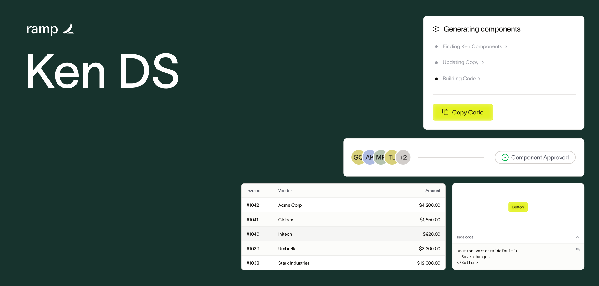
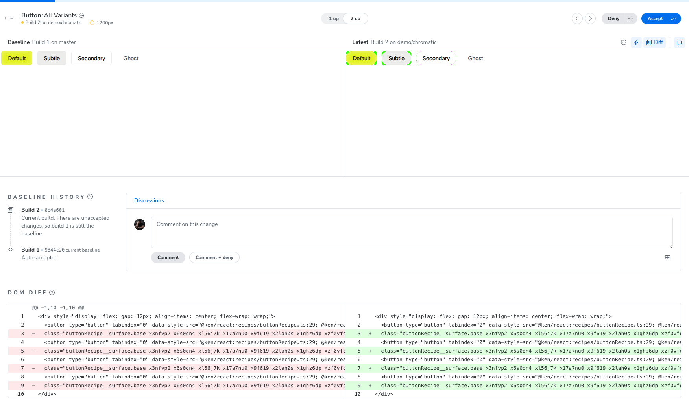
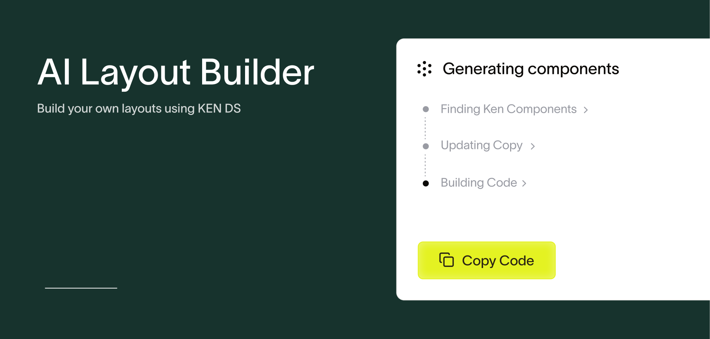

<p align="center">
  
</p>

# Ken — Ramp Design System

<p align="center">
  <a href="https://kenplayground.vercel.app/login"><b>🔗 Live playground</b></a>
  &nbsp;·&nbsp;
  <a href="https://6a3f0a5c077ba8f2b57024b7-jvmzkiwdfo.chromatic.com/?path=/story/atoms-avatar--playground"><b>📕 Storybook</b></a>
</p>

A recreation of **Ramp's** design system as an **LLM-safe design system**: tokens that encode _decisions_ (not values), components with no escape hatches, and **CI as a contract**. It ships as a **Geist-style docs site** (vercel.com/geist) and is crowned by an **AI Builder** that generates UI using the system's own components.

> **The Figma with the full system** — 120 tokens, the foundations, 30+ components and their ~300 variants — is the source of truth and lives here:
> **https://www.figma.com/design/o234ZHJNVR7DpbdPaZraAI/Ken---Ramp-Design-System?node-id=108-725&t=xxz9kd52q1Gp6XPT-1**

---

## Table of contents

- [Up front: this is for large companies](#up-front-this-is-for-large-companies)
- [Why this stack](#why-this-stack)
  - [Why the repo is split into packages](#why-the-repo-is-split-into-packages)
  - [Why StyleX](#why-stylex)
  - [Why Next.js](#why-nextjs)
  - [Microinteractions: Emil Kowalski's skill](#microinteractions-emil-kowalskis-skill)
- [The LLM-safe thesis in four principles](#the-llm-safe-thesis-in-four-principles)
- [Token architecture](#token-architecture)
- [Storybook: Ken's workbench](#storybook-kens-workbench)
  - [Visual review with Chromatic](#visual-review-with-chromatic)
- [Documentation: every component ships its own](#documentation-every-component-ships-its-own)
- [AI Builder](#ai-builder)
- [Running it](#running-it)
- [Repo structure](#repo-structure)

---

## Up front: this is for large companies

The stack and repo shape we picked here **only make sense at a certain scale**. Splitting out a versioned package with its own Storybook, gatekeeping every style through typed tokens, and banning raw HTML is the right investment when **many teams** consume the same system and the cost of inconsistency is high: a rebrand touches one file instead of a thousand; a new component physically cannot escape the system because the compiler won't let it.

### How this plays out in a startup

In a **startup I wouldn't build this**. There the constraint is the opposite — few people, short runway, and shipping today beats shipping consistently. So the calculus flips:

- **Speed over ceremony.** You reach for **Tailwind + shadcn components**: copy, paste, tweak, ship. No versioned package, no token compiler in the way, no Storybook to keep green.
- **Inconsistency is cheap.** With one or two people writing UI, a stray `gray-100` or a one-off `<div>` costs almost nothing — there's no fleet of teams drifting apart, so the gatekeeping has nothing to protect.
- **Re-theming isn't a requirement yet.** You usually have one brand and one product; the multi-brand payoff that justifies the token layer simply isn't on the table.

In that world, every guardrail in this repo turns into an anchor. The discipline only starts paying for itself once there are enough teams and enough surface area that **inconsistency becomes the expensive thing** — and that's exactly the context this system is designed for.

This project is deliberately the structured end of that trade-off: **more structure up front in exchange for consistency, maintainability, and re-theming at scale**. Being clear about that is part of the deliverable — the system's value depends on applying it in the right context.

---

## Why this stack

### Why the repo is split into packages

It's a **pnpm monorepo** with three packages and a hard boundary between the **library** and whoever **consumes** it:

| Package | What it is | Why it lives in isolation |
| --- | --- | --- |
| **`ken/`** → `@ken/react` | The design system: `components/`, `theme/` (tokens), and `recipes/` | It's the reusable product. Isolated so a **large team can maintain it** with its own lifecycle, its own Storybook, and its own gates — without the app being able to break it. |
| **`ai/`** → `@ken/ai` | The AI Builder engine (`catalog · prompt · spec · stream`) | The UI-generation logic is framework-agnostic and is tested on its own (Vitest). |
| **`playground/`** | The Next.js app that shows and consumes Ken via `workspace:*` | It's the client. It imports `@ken/react` as **source** (not a pre-built bundle) and exercises it under real conditions. |

The split **is the point, not an organizational detail**: Ken knows nothing about the app, and the app has no way to reach inside Ken. That boundary is what makes the re-theming promise credible — to bring up a new brand you remap the tokens in one file and the components react, without touching a single line of any component.

### Why StyleX

The decision comes from [this tweet by Emil Widlund](https://x.com/emilwidlund/status/2066804861325217948): at **Polar.sh** they're building their library on StyleX. The reason is that **StyleX is the gatekeeper** of the LLM-safe thesis — it isn't just "another way to write CSS":

- **Tokens are typed TypeScript modules** (`*.stylex.ts`) that compile to CSS custom properties. **The type system _is_ the API**: a prop like `spacing` or `backgroundColor` only accepts the defined semantic keys. No loose `gray-100`, no inline hex, no `tailwind.config`, no runtime getters.
- That's why primitives like **`Box`**, `Stack`, and `Text` exist: so that **everyone respects the same tokens and components**. There's no raw `<div>` that can escape the system — all layout goes through a polymorphic, typed `Box` whose autocomplete only offers valid values.
- It's what makes the line "docs are a suggestion, **CI is a contract**" actually _enforceable_: if a component tries to use a value outside the system, it doesn't compile.

### Why Next.js

App Router **collapses the AI Builder's backend into the same app** (API routes) instead of a separate project — the deciding factor for stage 2. It's also the natural path for a Geist-style docs site: MDX, machine-readable `.md` pages, live previews.

### Microinteractions: Emil Kowalski's skill

The entire interaction layer follows [**Emil Kowalski's** animation skill](https://emilkowal.ski/). It's not decoration: it's what makes the system **feel** like Ramp, not just look like it. The rules are explicit and applied to every component:

- Hover / color → `ease` ~200ms (eases in, doesn't jump).
- Press → `transform: scale(0.97)` on `:active` ~140ms `ease-out`.
- Transition properties **always explicit** (never `transition: all`), everything under 300ms.
- Subtle tints via `color-mix(...)` to stay on-hue and themeable.
- Interactive pseudo-states guarded with `:not(:disabled)` so an inactive control doesn't "respond".

---

## The LLM-safe thesis in four principles

Based on Polar.sh's article _"Orbit: An LLM-Safe Design System"_. These four principles are the system's contract, and each one has a mechanism that enforces it:

1. **Decisions, not values.** Tokens encode the _why_ (`backgroundCard`, `textPrimary`), not the hex. Whoever writes UI picks an intent, not a color.
2. **CI as a contract.** Compliance is non-negotiable because the StyleX compiler and the tests verify it — not the goodwill of whoever reviews the PR.
3. **No escape hatches.** No raw `<div>`. Everything goes through polymorphic, typed `Box`/`Stack`/`Text`.
4. **Built on accessible primitives.** Every component is built on a **Base UI** primitive (`@base-ui-components/react`) → focus, keyboard, and a11y for free and consistent, not reinvented per component.

---

## Token architecture

Two layers (reference → semantic) + shared recipes + themes. A component **never** touches the `core/` layer or a raw hex/px: only semantic tokens and foundations.

```
ken/theme/
├── core/
│   └── palette.stylex.ts      ← private PRIMITIVES (obsidian, charcoal, limestone…). The "what". Never imported by a component.
├── tokens/                    ← SEMANTIC: the public API. The "why".
│   ├── color.stylex.ts          backgroundCard, textPrimary, borderDefault, accentDefault…
│   ├── typography.stylex.ts     fontSans/Mono, fontSize*, fontWeight*, lineHeight*, tracking*
│   ├── space.stylex.ts          semantic scale (multiples of 4), no loose px
│   ├── radius.stylex.ts         radiusSm, radiusMd, radiusFull…
│   ├── elevation.stylex.ts      shadows / elevation
│   ├── motion.stylex.ts         durationFast, easeStandard… (for animation)
│   ├── avatarTint.stylex.ts · zIndex.stylex.ts
├── foundations/               ← CROSS-CONTROL recipes (used by many components)
│   ├── focusRing.ts             the shared focus ring
│   ├── field.ts                 shell for text-controls (Input, SearchInput…)
│   ├── overlay.ts               shared floating surface (menus, selects)
│   └── iconSize.ts · breakpoint.ts
└── index.ts                   ← re-exports ONLY semantics + foundations (NEVER core/)
```

**Where a component's styling lives** (heuristic, rule of second use — don't abstract on the first use):

- **Component family** → `ken/recipes/<x>Recipe.ts` (`buttonRecipe.ts` is shared by Button/LinkButton/IconButton; `chipRecipe.ts` by Badge/Pill).
- **Cross-control** (used by any control) → `ken/theme/foundations/*`.
- **A single component** → co-located `<Component>.styles.ts`.

---

## Storybook: Ken's workbench

`ken/` ships its **own Storybook** (`pnpm storybook`, port 6006), with a co-located `*.stories.tsx` per component (CSF3). It exists to **make life easier for the people who develop and maintain the design system**: each component can be built, tweaked, and reviewed in isolation — every variant and state on screen at once, outside the app — so the team working on Ken has a focused workbench with a lifecycle independent of the playground.

`pnpm build-storybook` is also a **gate**: it compiles StyleX and validates every story. Together with `tsc --noEmit`, it's the required verification before a component is considered done.

### Visual review with Chromatic

Storybook isn't just a local workbench — it's also published to **[Chromatic](https://www.chromatic.com/)** on every push and pull request ([`.github/workflows/chromatic.yml`](.github/workflows/chromatic.yml)). A push to `main` sets the visual **baseline**; each PR snapshots all the stories and posts a **visual-review check** that flags exactly which pixels changed — visual regression testing for free.

Here's a real example: [**PR #1**](https://github.com/germanquintela/Ken-Design-System/pull/1) changes the buttons from rounded corners to pill-shaped (`radius.control → radius.full`). Chromatic catches it instantly — **baseline on the left, the branch on the right**, with the DOM diff underneath pinpointing the exact `borderRadius` change:

<p align="center">
  
</p>

**A designer is the gate.** The Chromatic check is wired as a **required status check**, and it only turns green once a **designer reviews and approves the visual changes in Chromatic** — so design sign-off lives inside the merge flow itself, not in a Slack thread. While there are unreviewed snapshots the check stays red and **GitHub won't let the PR merge**: a designer opens the diff, approves the intentional changes (like the pill buttons above) or rejects a regression, and only then can the PR be merged. It's the _"CI is a contract"_ thesis extended to **visual** review — design approval becomes a hard gate, so a stray pixel can never reach the app without a human who owns the design having said yes.

---

## Documentation: every component ships its own

Repo rule: **every component added to Ken comes with its documentation in the repo, and that doc automatically generates an explanatory page in the playground.** Docs aren't an optional extra — they're part of "adding a component".

- Each component carries a co-located `doc.md` (template: `ken/components/DOC_TEMPLATE.md`).
- A codegen step (`gen-docs`) reads it, extracts the props via TypeScript (`react-docgen-typescript`), and produces the `/components` and `/foundations` pages, with live preview + code snippet + props table.
- The pages explain the **why** behind each decision, not just the _what_ — the Geist spirit.

The result: adding a component = **export it + write its `doc.md`**. The page shows up on its own, no site edits needed.

---

## AI Builder

<p align="center">
  
</p>

A chat that, from a natural-language request, **generates UI using Ken's components** and lets you copy/paste the code. The idea is that **marketing or development teams** can interact with the components and assemble real UIs without writing the boilerplate — and that whatever gets generated is, by construction, on-brand and valid.

**Under the hood:**

- Runs against **OpenRouter** (model `meta-llama/llama-3.3-70b-instruct`) behind a Next API route (`/api/build`).
- The entire engine lives in the **`ai/` (`@ken/ai`)** package, split into four domains:
  - **`catalog/`** — the component instruction sheet the model sees, _and_ the name allowlist the sanitizer uses.
  - **`prompt/`** — system prompt + few-shots + refinement logic.
  - **`spec/`** — the UI format the model produces and its **sanitization** (security, not parsing: the sanitizer is lenient and drops anything not in the allowlist instead of failing all-or-nothing).
  - **`stream/`** — the SSE transport.
- It **streams**: the model's response arrives over **Server-Sent Events** and renders into the canvas **as it's generated** (incremental parsing in `ai/stream/sse.ts` + `ai/spec/incremental.ts`).
- Conversations and versions are persisted (Supabase with RLS); the canvas has a navigable version history.

---

## Running it

Requirements: **Node + pnpm 11**.

```bash
pnpm install

pnpm dev              # playground (Next.js)     → http://localhost:3000
pnpm storybook        # Ken's workbench           → http://localhost:6006

pnpm build            # production build of the playground
pnpm test             # @ken/ai + playground tests (Vitest)
pnpm check            # Biome: format + lint
pnpm build-storybook  # static Storybook artifact (also the StyleX gate)
```

> The AI Builder needs `OPENROUTER_API_KEY` in the playground environment. Conversation persistence uses Supabase variables.

---

## Repo structure

```
ramp/
├── ken/                @ken/react — the design system
│   ├── components/        35+ components (each with stories + doc.md)
│   ├── theme/             tokens (core → semantic) + foundations
│   ├── recipes/           recipes shared by family (button, chip)
│   └── .storybook/        Vite workbench + StyleX plugin
├── ai/                 @ken/ai — the AI Builder engine
│   ├── catalog/  prompt/  spec/  stream/
├── playground/         Next.js app: Geist-style docs + AI Builder
│   └── src/              app/ · containers/ · components/ · services/ · hooks/ · schemas/
├── CLAUDE.md           full design decisions (written source of truth)
└── pnpm-workspace.yaml
```

---

<p align="center">
  Made with 🖤 by <a href="https://germanquintela.dev/">germanquintela.dev</a>
</p>
